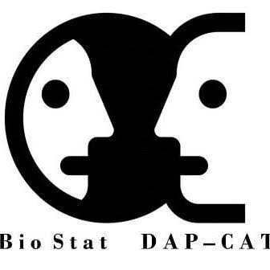

```{r, include = FALSE}
knitr::opts_chunk$set(
  collapse = TRUE,
  comment = "#>"
)
```

```{r setup1,include = TRUE,echo=FALSE,fig.align = 'center',out.width="15%"}


knitr::include_graphics("logoDAP_Cat.PNG")
knitr::include_graphics("logoIDIAP.PNG")

```

## CODI EXEMPLE : Package Platan
```{r setup,include = TRUE}

library("dplyr")
library("devtools")
library("Platan")
library("data.table")
library("compareGroups")

#devtools::install_github("USR-DAPCAT/Platan",build_vignettes = TRUE)
#help(package = 'Platan', help_type = 'html')
# or see a standalone list of vignettes
#browseVignettes('Platan')

########################################
#
#

#You have probably seen the odd chunk I often include in the top of my lecture documents, which has something like #knitr::opts_chunk$set(echo = TRUE) in it. This code sets the overall document options, so I can do something for every #chunk in my document.

#Opcions de trossos(CHUNKS) particulars
#Podeu establir les mateixes opcions per fragment, posant les opcions a la capçalera del fragment, com ara:
#```{r, eval=FALSE}

#Opcions importants a conèixer:

# https://bookdown.org/yihui/rmarkdown-cookbook/ (web molt interessant!)
# https://beatrizmilz.github.io/RStudio_Certification/slides.html#1   (web molt interessant!)

# message=FALSE Impedeix que paquets com el mosaic imprimeixin tots els seus missatges quan es carreguen.
# warning=FALSE Evita que els paquets mostrin avisos si hi ha un conflicte de versió
# error=FALSE   Es pot utilitzar per fer un punt de document fins i tot si hi ha un problema en un tros
# echo=TRUE     Mostra el codi, on echo=FALSE amagaria el codi.
# eval=TRUE     Significa avaluar (executar) el codi, on eval=FALSE només mostrarà el codi però no l'avaluarà.
# cache=TRUE    Vegeu a continuació “shortening knit time.”


#
#
########################################

```
##  Generacio de tabla plana  i  part descriptiva
```{r setup2, include = FALSE}
#rm(list=ls())
#library(dplyr)
#
# Funcions (provisional, quan tinguem la llibreria , ja no caldra!!!) 
#link_source<-paste0("https://github.com/jrealgatius/Stat_codis/blob/master/funcions_propies.R","?raw=T")
#devtools::source_url(link_source)
#
#conductor_codis<-here::here("CATALEG.xlsx")
#
#directori_dades_origen<-params$dir_dades_origen
#
#dt_cataleg<-readxl::read_excel(conductor_codis,col_types = "text")%>% select(cod,domini,agr,agr_Farmac,DM2)
#
#
#[S'ha d'instal.lar les llibreries:
#i)       Platan(aplanar les bases de dades.DapCat)
#ii)      Formatge(formatejar dades.DapCat)
#iii)     Macedonia(altres funcions.DapCat )
#
#
#devtools::install_github("USR-DAPCAT/Platan")
#devtools::install_github("USR-DAPCAT/FormatGe")
#devtools::install_github("USR-DAPCAT/Macedonia")
#devtools::install_github("USR-DAPCAT/ggflowchart2")
#
#library("Platan")
#library("FormatGe")
#library("Macedonia")
#library("ggflowchart2")
```
## 1. Lectura previa Data.Index 
```{r lectura1, ,include=TRUE}

# 1 Lectura -----------

#i)
dt_poblacio<-dt_poblacio%>%
  as_tibble()

#ii)
dt_variables<-dt_variables%>%
  as_tibble()

dt_variables


```
## 2. Generar Data.Index Disseny Transversal
```{r generem la data_Index, include=TRUE}


# 2 Data.Index -----------

dt_poblacio<-dt_poblacio%>%mutate(sortida=as.integer(20221111))

dt_poblacio

dt_index<-
  dt_poblacio %>% select(idp,entrada,sortida) %>% mutate(kk=1)%>%
  left_join(tibble(dtindex=seq(20221111,20221111,by=10000),kk=1),by="kk")%>%
  filter(entrada<=dtindex & dtindex<=sortida)  %>%  # Filtro per usuari actiu en data index
  select(-c(kk,entrada,sortida))

dt_index$dtindex<-as.character(dt_index$dtindex)

dt_index

```
## 3. Lectura posterior a Data.Index 
```{r lectura2, ,include=TRUE}

# 3 Lectura posterior a DataIndex -----------

#[pluri]
#dt_cmbdh_diagnostics<-readRDS(here::here(directori_dades_origen,"HTCPANCR_entregable_cmbdh_diagnostics_20210701_235119.rds")) %>% #as_tibble()  %>% 
#  semi_join(dt_index,by="idp")


#iii)
dt_diagnostics<-dt_diagnostics%>%
  as_tibble()

dt_diagnostics

#iv)
dt_facturacio<-dt_facturacio%>%
  as_tibble()

dt_facturacio


#v)
dt_prescripcions<-dt_prescripcions%>%
  as_tibble()

dt_prescripcions

```
## 4. Agregacio dels nostres fitxers a partir del cataleg
```{r agregacio, ,include=TRUE}

# 4 Agregacio dels nostres fitxers a partir del cataleg -----------


#Agregacio Problemes de Salut.
dtagr_diagnostics<-agregar_problemes(dplyr::select(dt_diagnostics,idp,cod,dat),
                                     bd.dindex = dt_index,
                                     dt.agregadors=cataleg,
                                     finestra.dies=c(-Inf,0),prefix = "DG.",
                                     cataleg_mana=FALSE)

dtagr_diagnostics


#Agregacio Farmacs Facturats.
dtagr_facturacio<-agregar_facturacio(dt=dt_facturacio,
                                     bd.dindex=20220101,
                                     finestra.dies=c(-Inf,0),
                                     dt.agregadors=cataleg,
                                     prefix="FF.",
                                     camp_agregador="agr",
                                     agregar_data=FALSE,
                                     cataleg_mana=FALSE,
                                     acumular=NULL)
dtagr_facturacio


#Agregacio Farmacs Prescripcions.
dtagr_prescripcions<-agregar_prescripcions(dt=dt_prescripcions,
                                           bd.dindex=20220101,
                                           finestra.dies=c(-Inf,0),
                                           dt.agregadors=cataleg,
                                           prefix="FP.",
                                           camp_agregador="agr",
                                           agregar_data=FALSE,
                                           cataleg_mana =FALSE,
                                           acumular=NULL)
dtagr_prescripcions


#Agregacio Analitiques i Cliniques.
dtagr_variables<-agregar_analitiques(dt=dt_variables,
                                     bd.dindex=20220101,
                                     finestra.dies = c(-Inf,0))
dtagr_variables


#traiem la data Index, per la posterior unificacio.

dtagr_diagnostics<-dtagr_diagnostics%>%select(-dtindex)
dtagr_prescripcions<-dtagr_prescripcions%>%select(-dtindex)
dtagr_facturacio<-dtagr_facturacio%>%select(-dtindex)
dtagr_variables<-dtagr_variables%>%select(-dtindex)


```
## 5. Fusio 1

Fusionar part dels arxius agregats 
 
```{r fusio1,include=TRUE}


dt_plana1<-dt_index%>%
left_join(dt_poblacio,by="idp")%>%
  left_join(dtagr_diagnostics,by="idp")%>%
    left_join(dtagr_facturacio,by="idp")%>%
     left_join(dtagr_prescripcions,by="idp")%>%
      left_join(dtagr_variables,by="idp")
       
  
dt_plana1


```
## 6. Generacio GranFuncio: Agregacio+Fusio i convertir a Taula Plana
```{r GranFuncio,include=TRUE}

#Parametres:

#i)
fitxer=c("dt_diagnostics",
         "dt_facturacio",
         "dt_prescripcions",
         "dt_variables")

domini=c("diagnostics",
         "farmacs_facturats",
         "farmacs_prescrits",
         "variables")

Finestra1=c(-Inf,-Inf,-Inf,-Inf)

Finestra2=c(0,0,0,0)

camp=c("agr","agr","agr","cod")

funcio=c("first","first","first","last")

prefix =c("DG.","FF.","FP.",".valor")

dt_parametres<-data.frame(cbind(fitxer,domini,Finestra1,Finestra2,camp,prefix,funcio))
dt_parametres


KK<-Generar_taula_plana(
dt=dt_index,
cataleg=cataleg,
parametres=dt_parametres)

dt_plana2<-dt_poblacio%>%
  left_join(KK,by="idp")

dt_plana2


```
## 7. Fase Analisi
```{r analisis2,include=TRUE,warning=FALSE}

descrTable(dt_plana2)


```


```
